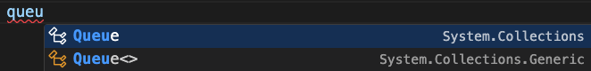
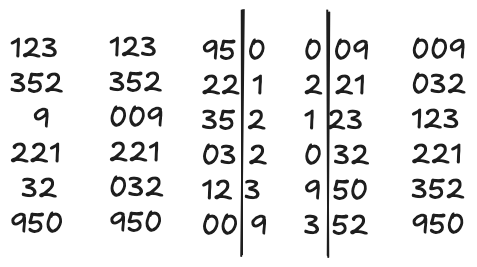
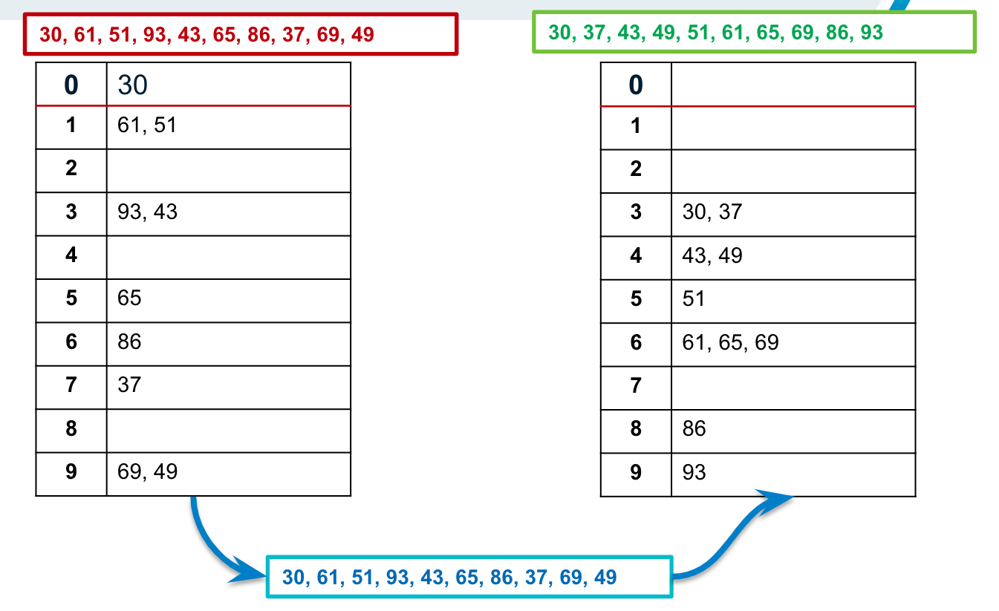
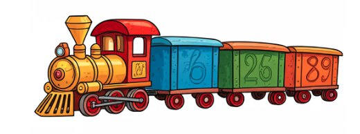

# SPA: Uvod


## Uvod


📌 Primjena gotovih klasa Stack/Queue

📌 Vezane liste - unos

📌 Vezane liste - brisanje


## Ugrađene klase Stack i Queue


### **Queue**

**Red** (eng. Queue) je struktura podataka koja radi na principu "prvi došao, prvi izašao" (FIFO - First In, First Out). Ovaj koncept je nalik redu u stvarnom svijetu, gdje se prvi klijent uvijek prvi poslužuje. Red omogućuje dodavanje elemenata na kraj strukture, dok se uklanjanje uvijek odvija na početku. Na taj način, red osigurava da se podaci obrađuju u istom redoslijedu u kojem su primljeni.

U C#-u, red se može implementirati korištenjem klase Queue, koja se nalazi u imenskom prostoru **System.Collections**. Korištenjem Queue klase, moguće je lako implementirati osnovne operacije, uključujući dodavanje elemenata (metoda **Enqueue**) i uklanjanje elemenata (metoda Dequeue). Također, metoda **Peek** omogućuje pregled prvog elementa bez njegovog uklanjanja, što je korisno kada želimo provjeriti sljedeći element bez izmjena u strukturi.

Korištenje klase **Queue&lt;T&gt;** koja se nalazi u **System.Collections.Generic** omogućuje primjenu konkretnog tipa.



Ako koristimo klasu Queue, onda moramo voditi računa o pretvorbi tipova svaki put kad nešto moramo napraviti s tim podacima. Pogledajmo unos podataka:

```
Queue q1 = new Queue();

// primjer unosa konstantnih vrijednosti
q1.Enqueue("tekst");
q1.Enqueue(122);
q1.Enqueue(3);
```

Implementacija gotove klase **Queue** dozvoljava "šetanje" po redu primjerice pomoću **foreach** petlje čak po svim elementima bez izbacivanja. Ako želimo koristiti klasično ponašanje reda, odnosno izbacivanje prvog elementa, onda će trebati postaviti varijablu na prvi element.

> aside negative
> 
> 📍**Važno:** Izbacujemo dok ima elemenata, a to nam vraća **svojstvo Count**.

```
object t = q1.Peek();
while (q1.Count > 0)
{
    Console.WriteLine(q1.Dequeue());
}
```

U gornjem primjeru koristimo varijablu tipa **object** u koju možemo spremiti bilo što. Međutim, problem je što ne znamo što smo spremili. Kod ispisa, metoda **WriteLine()** implicitno pretvara što god se nalazi u redu u string. Ako bi u redu unosili brojeve s kojima želimo nešto računati ili spremamo složeni tip (primjerak klase ili struct-a), onda implicitna pretvorba nije moguća.

U sljedećem primjeru možemo vidjeti postupak unosa brojeva u red.

* Korisnik unosi brojeve sve dok ne unese nešto što se ne može parsirati.
* Nakon završetka unosa, program izbacuje sve elemente redom te za svakog od njih ispisuje sljedbenika.

Na ovaj način smo "prisilili" korisnika da unosi cijele brojeve, ali svejedno kod izbacivanja moramo raditi eksplicitnu pretvorbu da bi broj stvarno mogli koristiti kao broj.

`Program.cs`

```cs
using System;
using System.Collections;

namespace test;

class Program
{
    static void Main(string[] args)
    {
        Queue q1 = new Queue();

        // unosimo brojeve
        bool ok = true;
        do
        {
            Console.WriteLine("Unesi broj: ");
            int br;
            ok = int.TryParse(Console.ReadLine(), out br);

            if (ok) q1.Enqueue(br);
        } while (ok);

        // izbacimo brojeve i ispišimo kvadrate svakog
        object t = q1.Peek();
        while (q1.Count > 0)
        {
            // cast operator za pretvorbu
            int br = (int)q1.Dequeue();
            Console.WriteLine($"Sljedbenik: {br + 1}");
        }
    }
}
```

Ako promijenimo tip u generički, onda nećemo morati raditi pretvorbu, a ostatak ostaje isti.

```
//...
Queue<int> q1 = new Queue<int>();
//...
int br = q1.Dequeue();
//...
```

Red ima različite primjene, kao što su upravljanje procesima u operacijskom sustavu, simulacije stvarnih redova ili čak osnovni sustavi za komunikaciju i razmjenu poruka. Učenje o redovima i njihovim operacijama pruža važne osnove za rad s podacima koji zahtijevaju obradu u specifičnom redoslijedu. Na primjer, redovi se mogu koristiti za raspoređivanje zadataka u programiranju gdje je važno da se zadaci izvršavaju točno onim redoslijedom kojim su stigli.

### **Stack**

Sve što je gore navedeno za **red** zapravo vrijedi i za **stog**, a jedina je razlika u tome što **Stack** ima metode **Push()** za dodavanje te **Pop()** za uklanjanje iz stoga te će se redoslijed ispisa promijeniti u skladu s definicijom stoga.

Prednost gotovih klasa je jednostavna implementacija svih metoda, ali nedostatak je kršenje principa (FIFO/LIFO) jer se *foreach* petljom ipak može pristupiti svim elementima. 

Generički tipovi omogućuju bržu obradu podataka jer kompajler unaprijed zna tip podataka koji će biti korišten, što omogućuje optimizaciju koda. Razumijevanje instanciranja i konfiguriranja reda prema specifičnim potrebama programa presudno je za učinkovit rad sa složenim strukturama podataka. 


## 📗 Zadatak: Radix sort


Radix sort je algoritam sortiranja koji grupira brojeve prema njihovim znamenkama počevši od najmanje značajne znamenke (jedinice) do najveće. Učinkovit je za sortiranje ključeva koji su iste duljine.

Može se implementirati i bez uspoređivanja već raspoređivanjem svih elemenata u "spremnike" (eng. buckets) ovisno o vrijednosti znamenke. Ponavljanjem tog raspoređivanja, Radix Sort na kraju ostvaruje konačan poredak. Ako ga implementiramo na ovaj način, onda moramo voditi računa kako ćemo zauzeti dodatan prostor u radnoj memoriji za pomoćne nizove.

Ako imamo niz podataka s različitim brojem znamenki, onda bi trebalo pronaći najvećeg jer o njemu (njegovom broju znamenki) ovisi broj koliko puta će se proći kroz sve elemente niza.

U sljedećem primjeru najveći broj je troznamenkast te će biti tri prolaza kroz algoritam. Za sve brojeve koji imaju manje znamenki, smatra se da su na početku nule.



Za našu implementaciju, koristit ćemo također ideju spremnika (eng. buckets) bez operacije uspoređivanja koji je veći. Svaki spremnk ćemo označiti znamenkom od 0 do 9 te ćemo samo razmjestiti brojeve ovisno o tome koju znamenku promatramo.

Radi jednostavnosti, uzet ćemo samo dvoznamenkaste brojeve kako bi na njima ilustrirali da algoritam radi. Naravno, vodite računa kako ovaj način implementacije nije nužno učinkovit jer u ovom zadatku imamo drugačije ciljeve:

> aside positive
> 
> ✅ Razumijevanje algoritma sortiranja **Radix sort**.
> 
> ✅ Primjena strukture **red** (klasa **Queue&lt;int&gt;**).

Par ideja:

* Ovdje će spremnike (ili kutije) glumiti **redovi** zato što će brojevi ulaziti i izlaziti iz kutija po principu FIFO.
* Koristit ćemo tip **Queue** samo zato što je malo kompliciraniji kako bi uočili trenutak kad je potrebno napraviti pretvorbu.
* Obzirom da imamo 10 znamenki, definirat ćemo i 10 kutija s odgovarajućim oznakama.
* Broj kutija je fiksan i unaprijed poznat pa ćemo koristiti **niz**.
* Ograničenje primjera na dvoznamenkaste brojeve znači da ćemo imati samo dva prolaza: po jedinicama pa po deseticama.

Pogledajmo na slici:



Krećemo od crveno obojanog niza, ubacimo ga u kutije po **jedinicama** te vratimo elemente natrag u niz (plavi) i ubacimo ih ponovo prema **deseticama**. Na kraju ćemo dobiti niz koji je sortiran (zeleni).

### **Korak 1: Napraviti niz od 10 redova**

```
Queue[] redZnam = new Queue[10];
```

Obzirom da će konstruktor svaki od 10 redova u početku postaviti na **null** (to je zadana vrijednost), onda svaki moramo posebno instancirati (stvoriti objekt):

```
for (int i = 0; i < 10; i++)
    redZnam[i] = new Queue();
```

### **Korak 2: Generirati n slučajno odabranih dvoznamenkastih brojeva**

Sortiramo slučajno odabrane dvoznamenkaste brojeve pa je potrebno generirati i taj niz. Neka korisnik unese broj koliko brojeva želi sortirati.

```
Console.Write("Unesi broj elemenata: ");
int x = int.Parse(Console.ReadLine());
Random r = new Random();
int[] brojevi = new int[x];
for (int i = 0; i < x; i++)
    brojevi[i] = r.Next(10, 100);
```

### **Korak 3: Rasporediti brojeve po znamenkama**

Ovaj korak se ponavlja dva puta, ali se postupak razlikuje minimalno pa možemo napraviti metodu koja će to obaviti. Napišimo metodu **RSort** koja prima "kutije", niz i koja znamenka je u pitanju.

```
static void RSort(Queue[] q, int[] niz, int vrstaZ)
{}
```

Metoda će proći kroz sve elemente niza i uzimati znamenku ovisno o vrsti. Svaka znamenka odgovara indeksu kutije tako da je jednostavno ubaciti element u red koji pripada toj znamenki.

`Program.cs`

```cs
static void RSort(Queue[] q, int[] niz, int vrstaZ)
{
    int n = niz.Length;
    for (int i = 0; i < n; i++)
    {
        int z;
        if (vrstaZ == 1) //ako su jedinice
            z = niz[i] % 10;
        else //ako su desetice
            z = niz[i] / 10;
        q[z].Enqueue(niz[i]); //stavi u odgovarajući red
    }
    //vrati natrag u niz
}
```

Dio s vraćanjem natrag u niz možemo, a ne morao odvojiti u posebnu metodu. Ipak ćemo odvojiti radi preglednosti kôda.

Osnovna ideja je:

* Proći kroz svih 10 "kutija" pa izbacivati elemente iz svake redom kako smo ih ubacili.

`Program.cs`

```cs
static void Vrati_uNiz(Queue[] q, int[] niz)
{
    int j = 0;
    for (int i = 0; i < 10; i++)
        while (q[i].Count > 0)
        {
            niz[j] = (int)q[i].Dequeue();
            j++;
        }
}
```

Gornja metoda se može riješiti i bez **cast** operatora (ako ste navikli na *parsiranje*):

```
niz[j] = int.Parse(q[i].Dequeue().ToString());
```

Međutim taj postupak nije optimalan jer:

* Element reda je tipa **object** koji se ne može parsirati (parsiraju se **samo stringovi**).
* Kako bi mogli parsirati, radimo pretvorbu u string pomoću **ToString()** metode.
* Nakon toga ide parsiranje.

Ukupno imamo **dvije** pretvorbe za razliku od **cast** operatora koji izravno pretvara **object** u **int**.

Metodu za ispis također možemo napisati jer se ponavlja više puta.

`Program.cs`

```cs
static void IspisNiza(int[] niz)
{
    for (int i = 0; i < niz.Length; i++)
        Console.Write(niz[i] + " ");
    Console.WriteLine();
}
```

Sad kad imate sve dijelove, napišite kompletno rješenje koje ima sljedeći ispis:

`Ispis:`

```
Unesi broj elemenata: 10

Prvi prolaz: 
40 90 61 44 54 54 26 77 27 38 

Drugi prolaz(konacno): 
26 27 38 40 44 54 54 61 77 90
```


## Vezane liste


Vezana lista je apstraktna struktura podataka koja povezuje elemente kroz veze (**reference**), slično kao što su vagoni povezani u vlak. 



Svaki element u vezanoj listi naziva se čvor, a svaki čvor ima vezu s drugim čvorovima, što omogućava lako dodavanje ili uklanjanje elemenata bez potrebe za pomicanjem podataka.

Postoje tri osnovne vrste vezanih lista:

* Jednostruke
* Dvostruke
* Cirkularne

U jednostrukoj vezanoj listi svaki čvor ima pokazivač na sljedeći čvor, dok dvostruka lista omogućuje pristup u oba smjera, jer svaki čvor ima dodatni pokazivač na prethodni čvor. Kod cirkularnih lista, zadnji čvor je povezan s prvim. Ove karakteristike čine vezane liste izuzetno fleksibilnima za manipulaciju podacima.

Razumijevanje vezanih lista važno je jer omogućuje stvaranje učinkovitijih struktura za pohranu podataka u slučajevima kada je potrebno često mijenjati veličinu ili strukturu nekog popisa. 

### **Pokazivač na listu**

*Pokazivač* na listu, odnosno na prvi element liste često se naziva **head**, ali u strukturi koja je implementirana u C# biblioteci naziva se **First**.

* Pokazuje na prvi element
* Mora biti inicijaliziran (pokazuje na čvor ili je null)

**Head** osigurava sekvencijalni pristup svakom čvoru u listi tako da svaki čvor poznaje samo svog sljedećeg susjeda. Ako je postavljen na null, lista je prazna, što je korisno za provjeru postojanja elemenata prije izvršavanja operacija poput pretraživanja ili brisanja.

Također, **head** služi kao ulazna točka za sve operacije nad listom. Razumijevanje uloge pokazivača pomaže shavaćanju kako se odvija organizacija podataka unutar liste i kako se učinkovito upravlja elementima pomoću jednostavnih veza.

### Čvorovi

**Čvor** (eng. node) u vezanoj listi sastoji se od:

* podatkovnog polja i
* pokazivačkog polja (reference)

Podatkovno polje sadrži vrijednost ili podatak koji čvor predstavlja, dok pokazivačko polje sadrži referencu prema sljedećem čvoru. U jednostrukim listama ovo pokazivačko polje se često naziva **Next**, dok dvostruke liste imaju dodatno polje **previous** za vezu prema prethodnom čvoru.

Pokazivačko polje **next** omogućava prijelaz kroz listu čvor po čvor, dok u dvostrukim listama polje **previous** olakšava kretanje u oba smjera. Ova struktura omogućuje fleksibilno i učinkovito dodavanje i uklanjanje čvorova unutar liste, posebno u situacijama gdje je važno zadržati točan redoslijed. Razumijevanje strukture čvora ključno je za rad s vezanim listama.

Ako radimo vlastitu strukturu vezane liste s posebnim čvorovima, onda se ne moramo nužno držati navedenih naziva niti strukture. Međutim, ako koristimo gotovu klasu, onda je to upravo oblik čvora.

Primjer klase **Student** koja ima oblik čvora (jer sadrži referencu **next**):

`Student.cs`

```cs
namespace UnosVL
{
    class Student
    {
        // ne moramo pisati svojstva
        public string ime;
        public int dob, mb;
        public Student next;

        public Student(string imeS, int dobS, int mbS)
        {
            this.ime = imeS;
            this.dob = dobS;
            this.mb = mbS;
            this.next = null;
        }

        public Student()
        {
            this.ime = "";
            this.dob = 0;
            this.mb = 0;
            this.next = null;
        }

    }
}
```

### **Temeljne operacije**

* **Unos** u listu - na početak, kraj, iza ili prije nekog drugog elementa.
* **Ispis** elemenata liste - svih ili dijela.
* **Pretraživanje** liste - traženje elementa u listi po zadanom kriteriju.
* **Brisanje** jednog ili više elemenata iz liste.


## 📗 Zadatak: Napraviti metode za rad s vezanom listom


Implementirajte sljedeće metode:

* public void DodajNaPocetak(Student novi) ⇒ dodaje novi čvor na početak
* public void DodajNaKraj(Student novi) ⇒ dodaje novi čvor na kraj
* public string Ispis() ⇒ vraća string za ispis
* public Student Trazi(int br) ⇒ vraća čvor koji je prvi pronađen ili null, ako ga nema.

Napomena: ova vezana lista se ne brine oko duplikata.

Neka klasa **VezanaLista** ima polje **pocetak**.


## 📗 Zadatak: Za one koji žele nešto više


Implementirajte metode za brisanje elemenata vezane liste:

* Brisanje prvog
* Brisanje zadnjeg
* Brisanje po matičnom broju ⇒ Neka briše prvog kojeg nađe.


